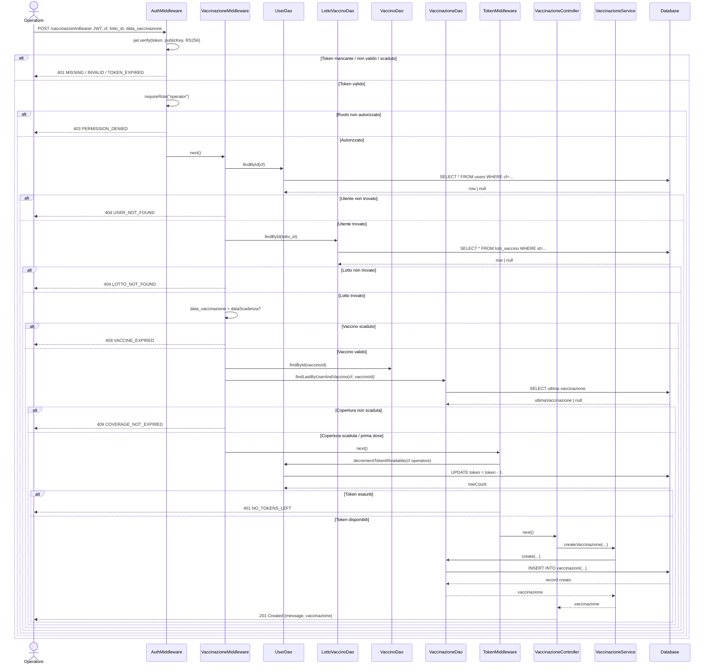
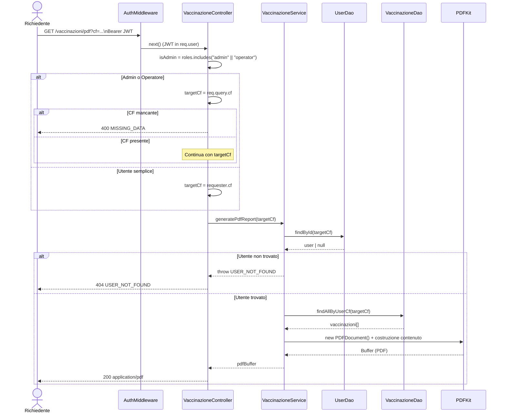
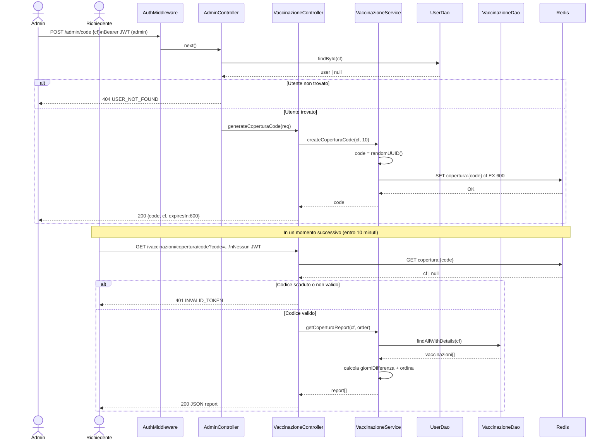
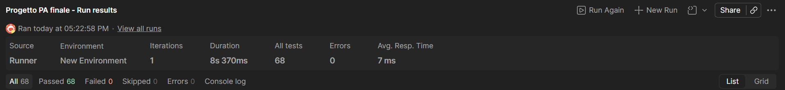

# Backend vaccinazione
Questo progetto consiste nella realizzazione di un backend che gestisce delle vaccinazioni.

- [Obiettivo del progetto](#obiettivo-del-progetto)
- [Progettazione](#progettazione)
- [Casi d'uso](#casi-duso)
- [Diagrammi di sequenza](#diagrammi-di-sequenza)
- [API Reference](#api-reference)
- [API Summary](#api-summary)
- [API Reference Detail](#api-reference-detail)
- [Design pattern utilizzati](#design-pattern-utilizzati)
- [Istruzioni per l'avvio del backend (Docker)](#istruzioni-per-lavvio-del-backend-docker)
- [Test del Progetto](#test-del-progetto)

# Obiettivo del progetto

L'obiettivo del progetto è lo sviluppo di un sistema backend che consenta la gestione delle vaccinazioni e dei relativi dati sanitari, al fine di dimostrare la comprensione dei concetti e delle buone pratiche relative allo sviluppo di API REST, autenticazione, gestione dati e architetture backend scalabili illustrate nel corso.

In generale, il sistema deve essere in grado di gestire i seguenti aspetti:

- gestione dei vaccini e delle relative informazioni (nome, durata della copertura);
- gestione delle dosi di vaccino (lotto, data di consegna, data di scadenza, disponibilità);
- registrazione delle vaccinazioni effettuate agli utenti;
- gestione degli utenti tramite codice fiscale;
- generazione di documenti PDF con lo storico delle vaccinazioni;
- analisi e visualizzazione di statistiche sui vaccini e sulle coperture;
- gestione della scadenza della copertura vaccinale degli utenti;
- utilizzo di codici temporanei per accesso ai dati tramite Redis.

---

## Autenticazione e autorizzazione

Il sistema utilizza autenticazione basata su **JWT (JSON Web Token)**.

Le tipologie di utenza previste sono:

- **user**: può consultare i propri dati vaccinali;
- **operator**: può registrare vaccinazioni e gestire vaccini e dosi;
- **both**: un utente può avere più ruoli contemporaneamente.
- **admin**: un utente che ha accesso a tutte le funzioni.

Il JWT contiene:
- metadati dell’utente
- codice fiscale
- lista dei ruoli

Se il numero di token disponibili per un utente termina, ogni richiesta deve restituire `401 Unauthorized`.

---

##  Funzionalità principali

Il sistema deve supportare le seguenti operazioni:

- Creazione di nuovi vaccini con durata della copertura;
- Aggiunta di dosi di vaccino (lotto, data consegna, scadenza);
- Consultazione vaccini con filtri su:
  - nome
  - disponibilità (>, <, range)
  - scadenza (>, <, range)
- Consultazione dosi disponibili per vaccino con filtri su quantità;
- Inserimento vaccinazione con validazioni:
  - utente esistente
  - lotto valido
  - vaccino non scaduto
  - copertura rispettata
- Recupero storico vaccinazioni utente in JSON e PDF;
- Statistiche vaccini:
  - min, max, media, deviazione standard
  - distribuzione mensile
- Individuazione utenti con copertura scaduta;
- Calcolo giorni rimanenti o scaduti per ogni vaccinazione;
- Generazione codice temporaneo (Redis) per accesso senza JWT.

---

## Sistema di token temporanei (Redis)

Il sistema consente la generazione di un codice univoco con durata limitata (N minuti).

Questo codice:
- viene salvato in Redis
- ha una scadenza (TTL)
- permette di accedere ai dati senza JWT
- viene invalidato automaticamente alla scadenza

---

## Tecnologie utilizzate

Il progetto è sviluppato in **TypeScript** e utilizza:

- **Node.js** → runtime backend
- **Express** → framework per API REST
- **Sequelize** → ORM per database relazionale
- **Redis** → gestione token temporanei e cache
- **PDFKit** → generazione PDF
- **RDBMS** → PostgreSQL

---

## Qualità del software

Il progetto include:

- utilizzo di middleware per:
  - autenticazione
  - validazione
  - gestione errori
- gestione centralizzata degli errori
- utilizzo di Design Pattern (documentati nel README)
- seed iniziali con dati realistici
- test con **Jest** (middleware)
- test API con **Postman**
- utilizzo di **Docker / docker-compose** per avvio sistema


# Design Pattern
## Singleton

Questo pattern garantisce un'unica istanza della connessione al database in tutta l'applicazione, evitando connessioni multiple e inutili al DB. Lo stesso principio si applica ai DAO/service: ogni modulo Node, una volta importato, restituisce sempre la stessa istanza evitando di istanziare più volte classi stateless che non hanno bisogno di essere ricreate ad ogni richiesta.

## DAO
Questo pattern separa la logica di accesso ai dati dalla logica di business. Questo rende il codice più testabile e disaccoppia il resto dell'applicazione dai dettagli specifici dell'ORM.

## Layered Architecture
Questo pattern grarantisce che ogni livello abbia una responsabilità singola e ben definita. Migliora la manutenibilità e la testabilità, perché ogni livello può essere modificato o testato isolatamente senza impattare gli altri.

## Chain of Responsability
Questo pattern garantisce che ogni middleware gestisca una singola validazione e decide se passare al controllo successivo  tramite next() o interrompere la catena rispondendo con un errore. Questo evita un blocco monolitico di if annidati nel controller, rende ogni controllo riusabile singolarmente e permette di aggiungere,togliere o riordinare controlli senza toccare la logica di business.

## Middleware pattern
Questo è un pattern architetturale specifico dell'ecosistema Express/Node, distinto dalla Chain of Responsibility pura perché qui ogni funzione ha accesso diretto a req e res condivisi  non solo alla decisione continua o fermati.

# API Reference

Seguono le API implementate.

## API Summary

| Rotta | Metodo HTTP | Ruolo autorizzato | Descrizione |
|------|------------|-------------------|-------------|
| /auth/login | POST | Utente non autenticato | Rotta di autenticazione |
| /users | POST | Admin | Crea un nuovo utente specificando il ruolo |
| /admin/addToken/:cf | PATCH | Admin | Ricarica token utente tramite codice fiscale |
| /admin/code | POST | Admin | Genera codice temporaneo Redis |
| /vaccini/:vaccinoId/lotti | POST | Admin | Crea un nuovo lotto vaccino |
| /vaccini/:vaccinoId/lotti | GET | Operator, Admin | Ottiene lotti di un dato vaccino |
| /coperturascaduta | GET | Operator,  Admin | Ottiene le coperture vaccinali scadute |
| /:cf | GET | Operator, Admin | Ottiene un utente dato un certo cf |
| / | GET | Admin | Ottiene tutti gli utenti |
| /:cf | DELETE | Admin | Cancella un utente dato un certo cf |
| /:cf | PATCH | Admin | Aggiorna un utente dato un certo cf |
| /vaccinazioni/:id | GET | Operator, Admin | Ottiene una singola vaccinazione dato un certo id |
| /vaccinazioni | GET | Admin | Ottiene tutte le vaccinazioni |
| /vaccinazioni/:id | PATCH | Operator, Admin| Aggiorna una vaccinazione dato un certo id |
| /vaccinazioni/:id | DELETE | Operator,  Admin | Cancella una vaccinazione dato un certo id |
| /pdf | GET | User, Admin | Ottieni un pdf specificando per admin nella query cf o altrimenti per user proprio cf|
| /filtrareuseradmin | GET | Admin, User | Ottiene vaccinazioni filtrare tramite cf nella query di un dato utente o di se stesso per user |
| /copertura | GET | Admin, User | Ottiene le coperture di un dato user, user solo le proprie|
| /copertura/pdf | GET | Admin, User | Ottiene le coperture di un dato user, user solo le proprie |
| /copertura/code | GET | Admin | Ottiene le coperture di un user tramite codice redis |
| /vaccino | POST | Admin | Crea un vaccino |
| /vaccini | GET | Admin | Legge tutti i vaccini |
| /vacciniFIltrati | GET | Admin | Legge i vaccini filtrandoli tramite query |
| /statistiche | GET | Admin | Ottiene le statistiche generali sui vaccini |
| /statistuche/copertura | GET | Admin | Ottiene statistiche sulle coperture |
| /:id | GET | Admin, Operator | Ottiene un singolo vaccino specificando un id |
| /:id | PATCH | Admin | Aggiorna un vaccino specificando un id |
| /:id | DELETE | Admin | Cancella un vaccino specificando un id |


# API Reference Detail

Di seguito sono riportate le rotte HTTP con la relativa descrizione e struttura delle richieste e risposte.

---

## POST /api/auth/login

Rotta utilizzata per autenticare un utente.  
L’utente deve fornire email e password nel body della richiesta HTTP.

Se le credenziali sono corrette viene restituito un token JWT utilizzato per le richieste successive.

---

### Richiesta

```http
POST /api/auth/login HTTP/1.1
Content-Type: application/json
```
### Body
```
{
  "email": "{{USER_ROLE_EMAIL}}",
  "password": "{{USER_ROLE_PSW}}"
}
```
### Richiesta con successo
```
{
  "token": "eyJhbGciOiJSUzI1NiIsInR5cCI6IkpXVCJ9.eyJjZiI6Ik5SQUdQUDkyRTE4QTY2MlUiLCJyb2xlcyI6WyJhZG1pbiJdLCJpYXQiOjE3ODI0ODIzNDEsImV4cCI6MTc4MjQ4NTk0MX0...."
}
```
## POST /users

Rotta utilizzata per creare un utente.  
L’utente deve fornire cf, nome, email, password e ruolo nel body della richiesta HTTP.

Se i dati sono corretti viene restituito un json con i parametri indicati nel body e la conferma del processo di creazione dell'utente.

---

### Richiesta

```http
POST /users HTTP/1.1
Content-Type: application/json
```
### Body
```
{
  "cf": "NRAGPP92E18A662U",
  "name": "Giuseppe neri",
  "email": "giuseppe.ner@email.it",
  "password": "password123",
  "role": "admin"
}
```
### Richiesta con successo
```
{
    "message": "User crato correttamente.",
    "user": {
        "token": 1,
        "cf": "NRAGPP92E18A662U",
        "name": "Giuseppe neri",
        "email": "giuseppe.ner@email.it",
        "role": "admin",
        "updatedAt": "2026-06-26T13:58:58.019Z",
        "createdAt": "2026-06-26T13:58:58.019Z"
    }
}
```
## PATCH /admin/addToken/:cf

Rotta utilizzata per aggiungere dei token ad un utente dato un certo cf.  
Nella rotta l'admin dovrà aggiungere alla fine il cf dell'utente che vuole venga ricaricato.
Nel body dovrà precisare la quantità di token da dare allo stesso.
Il body non può avere come numero di crediti un numero negativo.

Se i dati sono corretti viene restituito un json con il messaggio che informa del fatto che i token sono stati aggiornati e tutte le specifiche dell'user a cui l'aggiunta era rivolta con il numero di token corretti.

---

### Richiesta

```http
PATCH /admin/addToken/:cf HTTP/1.1
Content-Type: application/json
```
### Body
```
{
    "amount":  2
}

```
### Richiesta con successo
```
{
    "message": "Token aggiornato correttamente",
    "user": {
        "cf": "RSSMRA80A01H501U",
        "name": "Mario Rossi",
        "email": "mario.rossi@email.it",
        "token": 3,
        "role": "operator",
        "createdAt": "2026-06-29T13:17:54.996Z",
        "updatedAt": "2026-06-29T13:23:50.877Z"
    }
}
```

## POST /admin/code

Rotta utilizzata per creare un code Redis dato un cf che metteremo nel body.
Se la richiesta è andata a buon fine apparirà un json con il code di Redis e il cf a esso collegato con il tempo entro il quale scadrà.

---

### Richiesta

```http
POST /admin/code HTTP/1.1
Content-Type: application/json
```
### Body
```
{
  "cf": "RSSMRA80A01H501U"
}

```
### Richiesta con successo
```
{
    "code": "72aab61f-8a13-4d0e-a438-f5f2a08fec7e",
    "cf": "RSSMRA80A01H501U",
    "expiresIn": 600
}
```
## POST /vaccino

Rotta utilizzata per creare un vaccino dato il nome e la durata della copertura che metteremo nel body.
Se la richiesta è andata a buon fine apparirà un json con il messaggio di avvenuta creazione e tutti i dati del vaccino appena creato.

---

### Richiesta

```http
POST /vaccino HTTP/1.1
Content-Type: application/json
```
### Body
```
{
    "nome": "Bscottino",
    "durataCopertura": 80
}

```
### Richiesta con successo
```
{
    "message": "Vaccino creato correttamente",
    "vaccino": {
        "id": 5,
        "nome": "Bscottino",
        "durataCopertura": 80,
        "updatedAt": "2026-06-29T13:37:40.190Z",
        "createdAt": "2026-06-29T13:37:40.190Z"
    }
}
```

## GET /vaccini

Rotta utilizzata per visualizzare tutti i vaccini, il body è vuoto.
Se la richiesta è andata a buon fine avremo un array Json con tutti i vaccini presenti nel db.

---

### Richiesta

```http
GET /vaccini HTTP/1.1
Content-Type: application/json
```
### Body
```
```
### Richiesta con successo
```
[
    {
        "id": 1,
        "nome": "Pfizer",
        "durataCopertura": 180,
        "createdAt": "2026-06-29T13:37:09.495Z",
        "updatedAt": "2026-06-29T13:37:09.495Z"
    },
    {
        "id": 2,
        "nome": "Moderna",
        "durataCopertura": 365,
        "createdAt": "2026-06-29T13:37:09.495Z",
        "updatedAt": "2026-06-29T13:37:09.495Z"
    },
    {
        "id": 3,
        "nome": "AstraZeneca",
        "durataCopertura": 365,
        "createdAt": "2026-06-29T13:37:09.495Z",
        "updatedAt": "2026-06-29T13:37:09.495Z"
    },
    {
        "id": 4,
        "nome": "Antinfluenzale",
        "durataCopertura": 180,
        "createdAt": "2026-06-29T13:37:09.495Z",
        "updatedAt": "2026-06-29T13:37:09.495Z"
    },
    {
        "id": 5,
        "nome": "Bscottino",
        "durataCopertura": 80,
        "createdAt": "2026-06-29T13:37:40.190Z",
        "updatedAt": "2026-06-29T13:37:40.190Z"
    }
]
```

## GET /vacciniFiltrati

Rotta utilizzata per visualizzare i vaccini con la possibilità di filtrarli come richiesto nelle specifiche del progetto.
Più precisamente nella richiesta http è possibile filtrare attraverso:
- ?nome=Pfizer
- ?nome=Pfizer,Moderna
- ?scadenzaMaggioreDi=2026-01-01
- ?scadenzaMinoreDi=2026-12-31
- ?scadenzaMaggioreDi=2026-01-01&scadenzaMinoreDi=2026-12-31
- ?disponibilitaMin=100
- ?disponibilitaMax=500
- ?disponibilitaMin=100&disponibilitaMax=500
- ?nome=Pfizer,Moderna&scadenzaMaggioreDi=2026-01-01&scadenzaMinoreDi=2026-12-31&disponibilitaMin=100&disponibilitaMax=500

Il body è vuoto mentre se la richiesta ha successo il risultato sarà un json con tutti i medicinali trovati che rispettano i filtri.

---

### Richiesta

```http
GET /vacciniFiltrati HTTP/1.1
Content-Type: application/json
```
### Body
```
```
### Richiesta con successo
```
[
    {
        "id": 2,
        "nome": "Moderna",
        "durataCopertura": 365,
        "createdAt": "2026-06-29T13:37:09.495Z",
        "updatedAt": "2026-06-29T13:37:09.495Z",
        "disponibilitaTotale": "400"
    }
]
```


## GET /statistiche

Rotta utilizzata per visualizzare le statistiche dei vaccini come richiesto nelle specifiche del progetto.
Le statistiche avranno:
- media dosi consegnate
- statistiche mensili

Il body è vuoto mentre se la richiesta ha successo il risultato sarà un json con tutte le statistiche per vaccino.

---

### Richiesta

```http
GET /statistiche HTTP/1.1
Content-Type: application/json
```
### Body
```
```
### Richiesta con successo
```
{
    "vaccini": [
        {
            "id": 1,
            "nome": "Pfizer",
            "mediaDosiConsegnate": 400,
            "statisticheMensili": [
                {
                    "mese": 2,
                    "min": 1,
                    "max": 1,
                    "media": 1,
                    "deviazioneStandard": 0
                }
            ]
        },
        {
            "id": 2,
            "nome": "Moderna",
            "mediaDosiConsegnate": 400,
            "statisticheMensili": [
                {
                    "mese": 3,
                    "min": 1,
                    "max": 1,
                    "media": 1,
                    "deviazioneStandard": 0
                }
            ]
        },
        {
            "id": 3,
            "nome": "AstraZeneca",
            "mediaDosiConsegnate": 250,
            "statisticheMensili": []
        },
        {
            "id": 4,
            "nome": "Antinfluenzale",
            "mediaDosiConsegnate": 1000,
            "statisticheMensili": [
                {
                    "mese": 10,
                    "min": 1,
                    "max": 1,
                    "media": 1,
                    "deviazioneStandard": 0
                }
            ]
        },
        {
            "id": 5,
            "nome": "Bscottino",
            "mediaDosiConsegnate": 0,
            "statisticheMensili": []
        }
    ]
}
```
## GET /statistiche/copertura

Rotta utilizzata per visualizzare le statistiche dele coperture come richiesto nelle specifiche del progetto.
Le statistiche avranno:
- utenti scoperti entro 30 giorni
- utenti scoperti tra i 31 3 i 90 giorni
- utenti scoperti oltre i 90 giorni

Il body è vuoto mentre se la richiesta ha successo il risultato sarà un json con tutte le statistiche riguardanti le coperture del vaccino.

---

### Richiesta

```http
GET /statistiche/copertura HTTP/1.1
Content-Type: application/json
```
### Body
```
```
### Richiesta con successo
```
{
    "utentiScopertiEntro30Giorni": 0,
    "utentiScopertiTra31E90Giorni": 0,
    "utentiScopertiOltre90Giorni": 3
}
```

## GET /:id

Rotta utilizzata per visualizzare un vaccino dato un id che inseriremo dentro la richiesta

Il body è vuoto mentre se la richiesta ha successo il risultato sarà un json con il vaccino richiesto.

---

### Richiesta

```http
GET /1 HTTP/1.1
Content-Type: application/json
```
### Body
```
```
### Richiesta con successo
```
{
    "id": 1,
    "nome": "Pfizer",
    "durataCopertura": 180,
    "createdAt": "2026-06-29T13:37:09.495Z",
    "updatedAt": "2026-06-29T13:37:09.495Z"
}
```

##  PATCH /:id

Rotta utilizzata per modificare un vaccino dato un id che inseriremo dentro la richiesta.

Il body ha i dati da cambiare al suo interno mentre se la richiesta ha successo il risultato sarà un json con il vaccino cambiato.

---

### Richiesta

```http
PATCH /1 HTTP/1.1
Content-Type: application/json
```
### Body
```
{
    "nome": "Pfizerzzz",
    "durataCopertura": 180
}

```
### Richiesta con successo
```
{
    "message": "Vaccino aggiornato correttamente",
    "vaccino": {
        "id": 1,
        "nome": "Pfizerzzz",
        "durataCopertura": 180,
        "createdAt": "2026-06-29T13:37:09.495Z",
        "updatedAt": "2026-06-29T14:12:26.199Z"
    }
}
```


## DELETE /:id

Rotta utilizzata per eliminare un vaccino dato un id che inseriremo dentro la richiesta.

Il body è vuoto mentre se la richiesta ha successo il risultato sarà un json con l'avvenuta conferma di eliminazione.

---

### Richiesta

```http
DELETE /1 HTTP/1.1
Content-Type: application/json
```
### Body
```
```
### Richiesta con successo
```
{
    "message": "Vaccino cancellato correttamente"
}
```

## GET /:cf 

Rotta utilizzata per ottenere i dati di un user tramite cf.

Il body è vuoto mentre se la richiesta ha successo il risultato sarà un json con i dati dell'utente cercarto.

---

### Richiesta

```http
GET /BNCLCU81B10F205B HTTP/1.1
Content-Type: application/json
```
### Body
```
```
### Richiesta con successo
```
{
    "cf": "BNCLCU81B10F205B",
    "name": "Luca Bianchi",
    "email": "luca@email.it",
    "token": 1,
    "role": "user",
    "createdAt": "2026-07-03T08:11:14.133Z",
    "updatedAt": "2026-07-03T08:11:14.133Z"
}
```

## GET / 

Rotta utilizzata per ottenere i dati di tutti gli user.

Il body è vuoto mentre se la richiesta ha successo il risultato sarà un json con i dati di tutti gli utenti cercarti.

---

### Richiesta

```http
GET / HTTP/1.1
Content-Type: application/json
```
### Body
```
```
### Richiesta con successo
```
[
    {
        "cf": "RSSMRA80A01H501U",
        "name": "Mario Rossi",
        "email": "mario@email.it",
        "token": 1,
        "role": "admin",
        "createdAt": "2026-07-03T08:11:14.133Z",
        "updatedAt": "2026-07-03T08:11:14.133Z"
    },
    {
        "cf": "VRDLGI85B15F205X",
        "name": "Luigi Verdi",
        "email": "luigi@email.it",
        "token": 1,
        "role": "operator",
        "createdAt": "2026-07-03T08:11:14.133Z",
        "updatedAt": "2026-07-03T08:11:14.133Z"
    },
    {
        "cf": "BNCMRA90C20D612Y",
        "name": "Maria Bianchi",
        "email": "maria@email.it",
        "token": 1,
        "role": "user",
        "createdAt": "2026-07-03T08:11:14.133Z",
        "updatedAt": "2026-07-03T08:11:14.133Z"
    }
]
```
## DELETE /:cf

Rotta utilizzata per cancellare i dati di un user.

Il body è vuoto mentre se la richiesta ha successo il risultato sarà un messaggio che conferma l'avvenuta cancellazione dell'utente.

---

### Richiesta

```http
DELETE /BNCLCU81B10F205B HTTP/1.1
Content-Type: application/json
```
### Body
```
```
### Richiesta con successo
```
{
    "message": "User eliminato correttamente."
}

```

## PATCH /:cf

Rotta utilizzata per aggiornare i dati di un user.

Il body contiene i dati da aggiornare mentre se la richiesta ha successo il risultato sarà un json che conferma l'avvenuta aggiornamento dell'utente e ne mostra i risultati.

---

### Richiesta

```http
PATCH /VRDGNN87C20H501C HTTP/1.1
Content-Type: application/json
```
### Body
```
{
  "cf": "VRDGNN87C20H501C",
  "name": "Giuseppe neriiiiiii",
  "role": "admin"
}
```
### Richiesta con successo
```
{
    "message": "User aggiornato correttamente.",
    "user": {
        "cf": "VRDGNN87C20H501C",
        "name": "Giuseppe neriiiiiii",
        "email": "giovanni@email.it",
        "token": 1,
        "role": "admin",
        "createdAt": "2026-07-03T08:11:14.133Z",
        "updatedAt": "2026-07-03T09:20:40.022Z"
    }
}
```

## GET /vaccinazioni/:id 
Rotta utilizzata per vedere una vaccinazione dato un certo id.

Il body è vuoto mentre se la richiesta ha successo il risultato sarà un json con i dati della vaccinazione.

---

### Richiesta

```http
GET /vaccinaizoni/1 HTTP/1.1
Content-Type: application/json
```
### Body
```
```
### Richiesta con successo
```
{
    "id": 2,
    "userCf": "USR03CFTEST03",
    "vaccinoId": 1,
    "lottoId": 1,
    "dataVaccinazione": "2022-01-08T00:00:00.000Z",
    "createdAt": "2026-07-03T08:11:14.143Z",
    "updatedAt": "2026-07-03T08:11:14.143Z"
}
```

## POST /vaccinazioni
Rotta utilizzata per creare una vaccinazione.

Il body contiene le informazioni per creare la vaccinazione mentre se la richiesta ha successo il risultato sarà un json con i dati della vaccinazione e il messaggio di conferma.

---

### Richiesta

```http
POST /vaccinaizoni HTTP/1.1
Content-Type: application/json
```
### Body
```
{
  "cf": "RSSMRA80A01H501U",
  "lotto_id": 16,
  "data_vaccinazione": "2026-01-04"
}
```
### Richiesta con successo
```
{
    "message": "Vaccinazione creata correttamente",
    "vaccinazione": {
        "id": 279,
        "userCf": "RSSMRA80A01H501U",
        "lottoId": 16,
        "vaccinoId": 2,
        "dataVaccinazione": "2026-01-04T00:00:00.000Z",
        "updatedAt": "2026-07-03T09:24:47.024Z",
        "createdAt": "2026-07-03T09:24:47.024Z"
    }
}
```
## PATCH /vaccinazioni/:id
Rotta utilizzata per aggiornare una vaccinazione dato un certo id.

Il body contiene le informazioni per aggiornare la vaccinazione mentre se la richiesta ha successo il risultato sarà un json con i dati della vaccinazione e il messaggio di conferma.

---

### Richiesta

```http
PATCH /vaccinazioni HTTP/1.1
Content-Type: application/json
```
### Body
```
{
  "userCf": "RSSMRA80A01H501U",
  "lottoId": 1,
  "dataVaccinazione": "2027-01-04"
}
```
### Richiesta con successo
```
{
    "message": "Vaccizazione aggiornata correttamente",
    "vaccinazione": {
        "id": 2,
        "userCf": "RSSMRA80A01H501U",
        "vaccinoId": 1,
        "lottoId": 1,
        "dataVaccinazione": "2027-01-04T00:00:00.000Z",
        "createdAt": "2026-07-03T09:53:34.366Z",
        "updatedAt": "2026-07-03T09:56:14.759Z"
    }
}
```

## DELETE /vaccinazioni/:id
Rotta utilizzata per cancellare una vaccinazione dato un certo id.

Il body è vuoto mentre se la richiesta ha successo il risultato sarà un messaggio di conferma.

---

### Richiesta

```http
DELETE /vaccinaizoni/1 HTTP/1.1
Content-Type: application/json
```
### Body
```

```
### Richiesta con successo
```
{
    "message": "Vaccinazione cancellatta correttamente"
}
```

## GET /pdf 

Rotta utilizzata per vedere lo storico delle coperture tramite pdf.
l'admin potrà richiedere tramite richiesta http specificando il cf lo sotricodi un dato user, un user invece può vedere solo le sue.
Il body è vuoto mentre se la richiesta ha successo il risultato sarà un pdf con tutte le vaccinazioni di un dato utente o in generale tutte per admin.

---

### Richiesta

```http
GET /pdf HTTP/1.1
Content-Type: application/json
```
### Body
```
```
### Richiesta con successo
```
mettere immagine
```
## GET /filtrareuseradmin

Rotta utilizzata per vedere le vaccinazioni filtrare utilizzabile solo dall'admin.
L'admin potrà filtrare attraverso:
- ?nome=pfizer&dataMin=2024-01-01&dataMax=2024-12-31
- ?nome=moderna&before=2024-06-01
- ?cf=BNCMRA90C20D612Y&dataMin=2025-09-01&dataMax=2025-12-31
Il body è vuoto mentre se la richiesta ha successo il risultato sarà un json con tutte le vaccinazioni filtrate secondo i parametri.

---

### Richiesta

```http
GET /filtrareuseradmin HTTP/1.1
Content-Type: application/json
```
### Body
```
```
### Richiesta con successo
```
[
    {
        "id": 3,
        "userCf": "BNCMRA90C20D612Y",
        "vaccinoId": 4,
        "lottoId": 5,
        "dataVaccinazione": "2025-10-01T00:00:00.000Z",
        "createdAt": "2026-06-29T14:36:20.885Z",
        "updatedAt": "2026-06-29T14:36:20.885Z",
        "Vaccino": {
            "nome": "Antinfluenzale",
            "durataCopertura": 180
        },
        "LottoVaccino": {
            "codiceLotto": "FLU-2025-001"
        }
    }
]
```

## GET /copertura

Rotta utilizzata per vedere le vaccinazioni con le rispettive coperture.
L'admin potrà vederle di tutti gli user, gli user solo di loro stessi.
Inoltre si ha la possibilità di cambiare l'ordine in modo crescente o decrescente tramite richiesta ?order=asc o desc
Il body è vuoto mentre se la richiesta ha successo il risultato sarà un json con tutte le vaccinazioni con le rispettive coperture.
Nell'esempio abbiamo utilizzato admin per vedere tutte le vaccinazioni e coperture in ordine decrescente

---

### Richiesta

```http
GET /copertura HTTP/1.1
Content-Type: application/json
```
### Body
```
```
### Richiesta con successo
```
[
    {
        "vaccinazioneId": 3,
        "userCf": "BNCMRA90C20D612Y",
        "vaccino": "Antinfluenzale",
        "dataVaccinazione": "2025-10-01T00:00:00.000Z",
        "fineCopertura": "2026-03-30T00:00:00.000Z",
        "giorniDifferenza": -91,
        "statoCoperura": "scaduta"
    },
    {
        "vaccinazioneId": 2,
        "userCf": "VRDLGI85B15F205X",
        "vaccino": "Moderna",
        "dataVaccinazione": "2025-03-10T00:00:00.000Z",
        "fineCopertura": "2026-03-10T00:00:00.000Z",
        "giorniDifferenza": -111,
        "statoCoperura": "scaduta"
    },
    {
        "vaccinazioneId": 1,
        "userCf": "RSSMRA80A01H501U",
        "vaccino": "Pfizer",
        "dataVaccinazione": "2025-02-15T00:00:00.000Z",
        "fineCopertura": "2025-08-14T00:00:00.000Z",
        "giorniDifferenza": -319,
        "statoCoperura": "scaduta"
    }
]
```


## GET /copertura/pdf

Rotta utilizzata per vedere le vaccinazioni con le rispettive coperture ma solo di un dato user tramite pdf.
Il body è vuoto mentre se la richiesta ha successo il risultato sarà un pdf con tutte le vaccinazioni con le rispettive coperture di un dato user.
Si può scegliere se mettere in ordine crescente o decrescente le vaccinazioni

---

### Richiesta

```http
GET /copertura/pdf HTTP/1.1
Content-Type: application/json
```
### Body
```
```
### Richiesta con successo
```
immagine
```

## GET /copertura/code

Rotta utilizzata per vedere le vaccinazioni con le rispettive coperture di un dato user tramite un code redis evitando così l'uso di token JWT.
Il body è vuoto mentre se la richiesta ha successo il risultato saranno tutte le vaccinazioni con le rispettive coperture di un dato user.
?code=88c4b157-7caa-42f1-8226-49161cfa76ed il codice dovrà essere presente nella richiesta http.

---

### Richiesta

```http
GET /copertura/code HTTP/1.1
Content-Type: application/json
```
### Body
```
```
### Richiesta con successo
```
[
    {
        "vaccinazioneId": 1,
        "userCf": "RSSMRA80A01H501U",
        "vaccino": "Pfizer",
        "dataVaccinazione": "2025-02-15T00:00:00.000Z",
        "fineCopertura": "2025-08-14T00:00:00.000Z",
        "giorniDifferenza": -319,
        "statoCoperura": "scaduta"
    }
]
```

## POST /vaccini/:vaccinoId/lotti

Rotta utilizzata per creare un lotto dato un certo vaccino.
Il body contiene le informazioni del lotto  mentre se la richiesta ha successo il risultato un messaggio di avvenuta creazione e il body.

---

### Richiesta

```http
POST /vaccini/1/lotti HTTP/1.1
Content-Type: application/json
```
### Body
```
{
    "codiceLotto": "PFZ-2026-001",
    "quantitaDisponibile": 500,
    "dataConsegna": "2026-01-10",
    "dataScadenza": "2027-01-10"
}

```
### Richiesta con successo
```
{
    "id": 41,
    "vaccinoId": 1,
    "codiceLotto": "PFZ-2026-001",
    "quantitaDisponibile": 500,
    "dataConsegna": "2026-01-10T00:00:00.000Z",
    "dataScadenza": "2027-01-10T00:00:00.000Z",
    "updatedAt": "2026-07-03T10:01:29.346Z",
    "createdAt": "2026-07-03T10:01:29.346Z"
}
```

## GET /vaccini/:vaccinoId/lotti

Rotta utilizzata per vedere i lotti dato un certo vaccino.
Il body è vuoto  mentre se la richiesta ha successo il risultato è un json con tutti i lotti che corrispondono alla ricerca.

---

### Richiesta

```http
GET /vaccini/1/lotti HTTP/1.1
Content-Type: application/json
```
### Body
```

```
### Richiesta con successo
```
[
    {
        "id": 1,
        "vaccinoId": 1,
        "codiceLotto": "PFZ001",
        "quantitaDisponibile": 300,
        "dataConsegna": "2022-01-05T00:00:00.000Z",
        "dataScadenza": "2023-01-05T00:00:00.000Z",
        "createdAt": "2026-07-03T09:53:34.362Z",
        "updatedAt": "2026-07-03T09:53:34.362Z"
    },
    {
        "id": 2,
        "vaccinoId": 1,
        "codiceLotto": "PFZ002",
        "quantitaDisponibile": 450,
        "dataConsegna": "2023-01-10T00:00:00.000Z",
        "dataScadenza": "2024-01-10T00:00:00.000Z",
        "createdAt": "2026-07-03T09:53:34.362Z",
        "updatedAt": "2026-07-03T09:53:34.362Z"
    },
    {
        "id": 3,
        "vaccinoId": 1,
        "codiceLotto": "PFZ003",
        "quantitaDisponibile": 500,
        "dataConsegna": "2024-01-10T00:00:00.000Z",
        "dataScadenza": "2025-01-10T00:00:00.000Z",
        "createdAt": "2026-07-03T09:53:34.362Z",
        "updatedAt": "2026-07-03T09:53:34.362Z"
    },
    {
        "id": 13,
        "vaccinoId": 1,
        "codiceLotto": "PFZ004",
        "quantitaDisponibile": 650,
        "dataConsegna": "2025-01-15T00:00:00.000Z",
        "dataScadenza": "2026-01-15T00:00:00.000Z",
        "createdAt": "2026-07-03T09:53:34.362Z",
        "updatedAt": "2026-07-03T09:53:34.362Z"
    },
    {
        "id": 14,
        "vaccinoId": 1,
        "codiceLotto": "PFZ005",
        "quantitaDisponibile": 800,
        "dataConsegna": "2026-01-10T00:00:00.000Z",
        "dataScadenza": "2027-01-10T00:00:00.000Z",
        "createdAt": "2026-07-03T09:53:34.362Z",
        "updatedAt": "2026-07-03T09:53:34.362Z"
    },
    {
        "id": 21,
        "vaccinoId": 1,
        "codiceLotto": "PFZ2022",
        "quantitaDisponibile": 220,
        "dataConsegna": "2022-01-10T00:00:00.000Z",
        "dataScadenza": "2023-01-10T00:00:00.000Z",
        "createdAt": "2026-07-03T09:53:34.362Z",
        "updatedAt": "2026-07-03T09:53:34.362Z"
    },
    {
        "id": 22,
        "vaccinoId": 1,
        "codiceLotto": "PFZ2023",
        "quantitaDisponibile": 240,
        "dataConsegna": "2023-01-10T00:00:00.000Z",
        "dataScadenza": "2024-01-10T00:00:00.000Z",
        "createdAt": "2026-07-03T09:53:34.362Z",
        "updatedAt": "2026-07-03T09:53:34.362Z"
    },
    {
        "id": 23,
        "vaccinoId": 1,
        "codiceLotto": "PFZ2024",
        "quantitaDisponibile": 260,
        "dataConsegna": "2024-01-10T00:00:00.000Z",
        "dataScadenza": "2025-01-10T00:00:00.000Z",
        "createdAt": "2026-07-03T09:53:34.362Z",
        "updatedAt": "2026-07-03T09:53:34.362Z"
    }
]
```

## GET /coperturascaduta 

Rotta utilizzata per vedere gli user con una copertura scaduta, specificando i giorni di scadenza (?giorniMin=10&giorniMax=30) (?vaccino=Pfizer&giorniMin=0)
Il body è vuoto mentre se la richiesta ha successo il risultato saranno tutte le vaccinazioni con le rispettive coperture di un dato user opportunamente filtrate.

---

### Richiesta

```http
GET /coperturascaduta HTTP/1.1
Content-Type: application/json
```
### Body
```
```
### Richiesta con successo
```
{
        "cf": "USR02CFTEST02",
        "name": "User2",
        "email": "user2@mail.it",
        "token": 1,
        "role": "user",
        "createdAt": "2026-07-03T08:11:14.133Z",
        "updatedAt": "2026-07-03T08:11:14.133Z",
        "vaccinazioni": [
            {
                "id": 1,
                "userCf": "USR02CFTEST02",
                "vaccinoId": 1,
                "lottoId": 1,
                "dataVaccinazione": "2022-01-05T00:00:00.000Z",
                "createdAt": "2026-07-03T08:11:14.143Z",
                "updatedAt": "2026-07-03T08:11:14.143Z",
                "Vaccino": {
                    "id": 1,
                    "nome": "Pfizer",
                    "durataCopertura": 180,
                    "createdAt": "2026-07-03T08:11:14.136Z",
                    "updatedAt": "2026-07-03T08:11:14.136Z"
                }
            }
        ]
    }
```


# Progettazione
## Casi d'uso

## Diagrammi di sequenza

Creazione della vaccinazione


Get vaccinazioni



crea codice PDF




# Istruzioni per l'avvio del backend

```
git clone https://github.com/lmnkd/ProgettoPA
```
```
POSTGRES_USER=postgres
POSTGRES_PASSWORD=password
POSTGRES_DB=postgres
POSTGRES_PORT=5432
POSTGRES_HOST=postgres
JWT_PRIVATE_KEY_PATH=keys/private.pem
JWT_PUBLIC_KEY_PATH=keys/public.pem
JWT_EXPIRES_IN=1h
REDIS_HOST=redis
REDIS_PORT=6379
```

```
mkdir -p keys
openssl genrsa -out keys/private.pem 2048
openssl rsa -in keys/private.pem -pubout -out keys/public.pem
```

```
docker compose up --build
```

# Test del progetto

Il progetto include test unitari sviluppati con **Jest** per verificare il corretto funzionamento dei principali middleware dell'applicazione.

---

## Middleware dei Token

Il middleware `correctAmount` verifica la presenza e la validità del campo `amount` nel body della richiesta.

### Casi di test implementati:

- **Amount mancante**  
  Se il campo `amount` non è presente nel body della richiesta, il sistema restituisce un errore HTTP 400 con `MISSING_DATA` e non chiama `next()`.

- **Amount valido**  
  Se il campo `amount` è presente e valido, il middleware consente la prosecuzione della richiesta e chiama `next()`.

---

## Middleware dei Vaccini

Il middleware verifica la corretta gestione delle richieste relative ai vaccini.

### Casi di test implementati:

- **Vaccino esistente**  
  Se il vaccino esiste nel database, il middleware chiama `next()` permettendo la prosecuzione della richiesta.

- **Vaccini con più nomi**  
  Se la query contiene più nomi separati da virgola, il middleware li divide, esegue una ricerca per ciascun nome e chiama `next()` solo se tutti esistono.

- **Vaccino non esistente**  
  Se uno dei vaccini non esiste, il sistema restituisce un errore HTTP 404 con `VACCINO_NOT_FOUND`.
---

## Esecuzione dei test

```
npm run test
```
# Test delle API

Le funzionalità possono essere verificate effettuando il run della collection **Postman** presente nella cartella collections.
Alcune risposte, quelle che si hanno con il middlewware authenticate e requireRole non sono state ripetute ma sono utilizzate in tutte le altre rotte in cui non appaiono.

## 1. Rotte pubbliche di autenticazione (Auth)
Verifica dei flussi di login, generazione JWT e gestione errori credenziali.

* **POST /login** - Validazione fallita (campi mancanti) `400`
* **POST /login** - Credenziali errate (Utente non trovato) `401`
* **POST /login** - Login Utente (Successo) `200`
* **POST /login** - Login Utente "Low Token" (Successo) `200`
* **POST /login** - Login Operatore (Successo) `200`
* **POST /login** - Login Admin (Successo) `200`
* **Middleware** - JWT Invalido o scaduto `401`
* **Middleware** - JWT Vuoto/Mancante `401`

* **POST /users** - Dati obbligatori mancanti `400`
* **POST /users** - Token mancante `401`
* **POST /users** - Token non valido `401`
* **POST /users** - Token scaduto `401`
* **POST /users** - Permesso negato per l'operazione richiesta `403`
* **POST /users** - Codice fiscale già esistente `409`
* **POST /users** - Account con questo indirizzo email già esistente `409`
* **POST /users** - Creazione utente con successo `201`

---

## 2. Gestione amministratore (Admin)
Test delle operazioni riservate all'amministratore.

* **PATCH /admin/addToken/:cf** - Dati obbligatori mancanti `400`
* **PATCH /admin/addToken/:cf** - Dati non validi `400`
* **PATCH /admin/addToken/:cf** - Valori negativi non consentiti `400`
* **PATCH /admin/addToken/:cf** - User non trovato `404`
* **PATCH /admin/addToken/:cf** - Aggiornamento token con successo `200`

* **POST /admin/code** - Dati obbligatori mancanti `400`
* **POST /admin/code** - User non trovato `404`
* **POST /admin/code** - Generazione codice con successo `200`

---

## 3. Lotti vaccino
Test di creazione e consultazione dei lotti vaccinali.

* **POST /vaccini/:vaccinoId/lotti** - Dati obbligatori mancanti `400`
* **POST /vaccini/:vaccinoId/lotti** - Valori negativi non consentiti `400`
* **POST /vaccini/:vaccinoId/lotti** - Data fornita non valida `400`
* **POST /vaccini/:vaccinoId/lotti** - Vaccino non trovato `404`
* **POST /vaccini/:vaccinoId/lotti** - Lotto già esistente `409`
* **POST /vaccini/:vaccinoId/lotti** - Creazione lotto con successo `201`

* **GET /vaccini/:vaccinoId/lotti** - Vaccino non trovato `404`
* **GET /vaccini/:vaccinoId/lotti** - Visualizzazione lotti con successo `200`

---

## 4. Gestione utenti (User)
Test di consultazione, aggiornamento e cancellazione degli utenti.

* **GET /coperturascaduta** - Visualizzazione utenti con copertura scaduta `200`

* **GET /:cf** - User non trovato `404`
* **GET /:cf** - Visualizzazione utente con successo `200`

* **GET /** - Visualizzazione elenco utenti con successo `200`

* **PATCH /:cf** - User non trovato `404`
* **PATCH /:cf** - Aggiornamento utente con successo `200`

* **DELETE /:cf** - User non trovato `404`
* **DELETE /:cf** - Eliminazione utente con successo `200`

---

## 5. Vaccinazioni
Test di creazione, consultazione, aggiornamento, cancellazione e generazione documenti relativi alle vaccinazioni.

* **POST /vaccinazioni** - Dati obbligatori mancanti `400`
* **POST /vaccinazioni** - Nessun token rimasto `401`
* **POST /vaccinazioni** - User non trovato `404`
* **POST /vaccinazioni** - Lotto non trovato `404`
* **POST /vaccinazioni** - Lotto scaduto in base alla data di vaccinazione `409`
* **POST /vaccinazioni** - Copertura vaccinale precedente non ancora scaduta `409`
* **POST /vaccinazioni** - Creazione vaccinazione con successo `201`

* **GET /vaccinazioni/:id** - Vaccinazione non trovata `404`
* **GET /vaccinazioni/:id** - Visualizzazione vaccinazione con successo `200`

* **GET /vaccinazioni** - Visualizzazione elenco vaccinazioni con successo `200`

* **PATCH /vaccinazioni/:cf** - Dati obbligatori mancanti `400`
* **PATCH /vaccinazioni/:cf** - Nessun token rimasto `401`
* **PATCH /vaccinazioni/:cf** - User non trovato `404`
* **PATCH /vaccinazioni/:cf** - Lotto non trovato `404`
* **PATCH /vaccinazioni/:cf** - Aggiornamento vaccinazione con successo `200`

* **DELETE /vaccinazioni/:cf** - Vaccinazione non trovata `404`
* **DELETE /vaccinazioni/:cf** - Cancellazione vaccinazione con successo `200`

* **GET /pdf** - Dati obbligatori mancanti `400`
* **GET /pdf** - User non trovato `404`
* **GET /pdf** - Generazione PDF con successo `200`

* **GET /filtrareuseradmin** - Dati obbligatori mancanti `400`
* **GET /filtrareuseradmin** - Data fornita non valida `400`
* **GET /filtrareuseradmin** - User non trovato `404`
* **GET /filtrareuseradmin** - Vaccino non trovato `404`
* **GET /filtrareuseradmin** - Visualizzazione filtrata con successo `200`

* **GET /copertura** - User non trovato `404`
* **GET /copertura** - Visualizzazione copertura vaccinale con successo `200`

* **GET /copertura/pdf** - Dati obbligatori mancanti `400`
* **GET /copertura/pdf** - User non trovato `404`
* **GET /copertura/pdf** - Generazione PDF copertura con successo `200`

* **GET /copertura/code** - Dati obbligatori mancanti `400`
* **GET /copertura/code** - Token non valido `401`
* **GET /copertura/code** - Visualizzazione codice copertura con successo `200`

---

## 6. Vaccini
Test di creazione, consultazione, aggiornamento, cancellazione e statistiche relative ai vaccini.

* **POST /vaccino** - Dati non validi `400`
* **POST /vaccino** - Valori negativi non consentiti `400`
* **POST /vaccino** - Vaccino già esistente `409`
* **POST /vaccino** - Creazione vaccino con successo `201`

* **GET /vaccini** - Visualizzazione elenco vaccini con successo `200`

* **GET /vacciniFiltrati** - Dati non validi `400`
* **GET /vacciniFiltrati** - Data fornita non valida `400`
* **GET /vacciniFiltrati** - Valori negativi non consentiti `400`
* **GET /vacciniFiltrati** - Numeri non validi `400`
* **GET /vacciniFiltrati** - Vaccino non trovato `404`
* **GET /vacciniFiltrati** - Visualizzazione filtrata con successo `200`

* **GET /statistiche** - Visualizzazione statistiche con successo `200`

* **GET /statistiche/copertura** - Visualizzazione statistiche di copertura con successo `200`

* **GET /:id** - Vaccino non trovato `404`
* **GET /:id** - Visualizzazione vaccino con successo `200`

* **PATCH /:id** - Input non valido fornito `400`
* **PATCH /:id** - Valori negativi non consentiti `400`
* **PATCH /:id** - Vaccino non trovato `404`
* **PATCH /:id** - Aggiornamento vaccino con successo `200`

* **DELETE /:id** - Vaccino non trovato `404`
* **DELETE /:id** - Cancellazione vaccino con successo `200`

## Risultati




